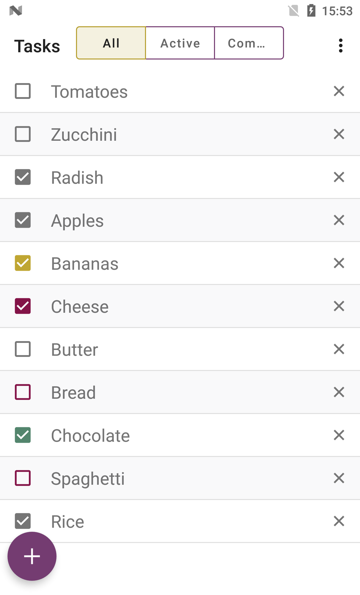

# Multiplatform mvp

[](https://opensource.org/licenses/Apache-2.0) 
[  ](https://bintray.com/olekdia/olekdia/multiplatform-mvp/0.1.1/link)

---

Kotlin multiplatform model-view-presenter framework.
This small in terms of API size framework allows you to create testable model and presenter abstractions, with view implementations on any platform.


### Setup

To use in multiplatform project add:

```gradle
dependencies {
  ...
  implementation("com.olekdia:mvp-common:0.1.1")
}
```

To use in platform specific projects include one of the following:
```gradle
dependencies {
  implementation("com.olekdia:mvp-common-jvm:0.1.1")
  implementation("com.olekdia:mvp-common-js:0.1.1")
  implementation("com.olekdia:mvp-common-native:0.1.1")
}
```

Make sure your Gradle vesion is 5.3+, and that you have metadata enabled in settings.gradle

```gradle
enableFeaturePreview("GRADLE_METADATA")
```

### Library

### TodoMVP example

TodoMVP is an application that is build to show how to use the framework.
It consists from two modules:
* **core-app** - is a platform independent module that contains:
  * _**domain**_ - contains business logic in models, data classes, repository interfaces
  * _**presentation**_ - contains presenters and view interfaces and manager interfaces
* **android-app** - android specific code which interacts with core module:
  * _**presentation**_ - contains implementations of views which is activities, fragments or dialog fragments
  * _**data**_ - contains implementations of repository interfaces, extensions on entries
  
core-app - contains 30 kotlin files with 900 lines of code.  
android-app - contains 23 kotlin files with 1662 lines of code.  
About 35% of code was moved to platform independent testable module
   
    